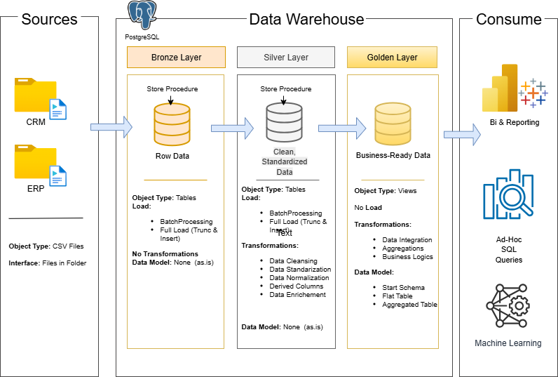

# SQL Data Warehouse & Analytics Project

Welcome to my **SQL Data Warehouse & Analytics Project** 🚀  
This repository demonstrates the design and implementation of a **SQL-based data warehouse**, including data ingestion, transformation, modeling, and analytical queries.  

Designed as a **portfolio project**, it highlights practical skills in **SQL, ETL, and data modeling**, following industry best practices for data engineering and analytics.

---

## 🏗️ Data Architecture

This project follows a multi-layered architecture inspired by the **Medallion Architecture**:

1. **Bronze Layer** → Raw data stored as-is from CSV sources.  
2. **Silver Layer** → Data cleansing, standardization, and transformation.  
3. **Gold Layer** → Business-ready data structured into star schema for reporting and analytics.  



---

## 📖 Project Overview

The project involves:

- **Data Architecture**: Structuring the data warehouse using Bronze, Silver, and Gold layers.  
- **ETL Pipelines**: Extracting, transforming, and loading CSV data into structured tables.  
- **Data Modeling**: Creating fact and dimension tables optimized for analytical queries.  
- **Analytics & Reporting**: Writing SQL queries to generate insights from the dataset.

---

## 🛠️ Tools & Technologies

- **SQL (pgAdmin 4 / PostgreSQL )**  
- **Draw.io** for architecture and data flow diagrams  
- **Git & GitHub** for version control  

---

## 📂 Repository Structure
```
data-warehouse-project/
│
├── datasets/ # CSV datasets used for the project
│
├── docs/ # Project documentation, diagrams, and notes
│  
├── scripts/ # SQL scripts for ETL and transformations
│   ├── bronze/ # Scripts for extracting and loading raw data
│   ├── silver/ # Scripts for cleaning and transforming data
│   ├── gold/ # Scripts for creating analytical models
│
├── tests/ # Test scripts and quality files
│
├── README.md # Project overview and instructions
└── LICENSE  # License information for the repository
```
---

